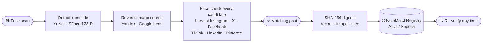

<div align="center">


# Veriface

**A face scan → the real social media post it appears in → a tamper-evident record on a blockchain.**

[](#)
[](#)
[](#)
[](#)
[](LICENSE)

*HH Goa 2026 · Shortlisting Task 3*

</div>

<br>



<br>

## Run it

```bash
git clone https://github.com/sachin-2004jlr/HHGOA3.git && cd HHGOA3
python -m venv .venv && .venv\Scripts\activate && pip install -r requirements.txt   # Linux/macOS: source .venv/bin/activate
npm run setup && cp .env.example .env      # keys in .env are optional (see below)
npm run dev                                # starts Anvil + API + web on free ports and opens the browser
```

Drop a photo or use the webcam, press **Run a scan**, watch the three stages complete.

<br>

## How it works

<table>
<tr>
<td width="33%" valign="top">

### 1 · Face scan
The photo or webcam frame goes through **YuNet** (detection) and **SFace** (encoding). The face becomes a 128-number vector that is hashed, never published.

</td>
<td width="33%" valign="top">

### 2 · Find the post
A tight face crop is sent to **Yandex** and **Google Lens**. Every page they return is downloaded and its face compared with the scan. The person's name is read only from pages whose face matched, then **Apify** harvests their pictures from Instagram, X, Facebook, TikTok, LinkedIn and Google Images, plus Pinterest. All of it is face-checked; the best first-party post wins.

</td>
<td width="33%" valign="top">

### 3 · Seal it on chain
SHA-256 digests of the record, the post image and the face vector are written to the **FaceMatchRegistry** contract with the post URL, platform and score. **Re-verify** recomputes every hash from disk and compares it with the chain; **Tamper test** changes one byte and shows it fail.

</td>
</tr>
</table>

Nothing is pre-picked: candidates, the identified name, the chosen post and its score come from live searches and the face model at run time.

<br>

<div align="center">

<br><br>

</div>

<br>

## The blockchain

| Backend | What | When |
|---|---|---|
| **Anvil** (default) | Real local EVM node, started by `npm run dev`, state kept in `.anvil/` | Offline demo, no faucet |
| **Ethereum Sepolia** | Set `RPC_URL` + a funded `PRIVATE_KEY` in `.env`, run `python -m facechain deploy` | Public, Etherscan links |
| **Simulated chain** | Proof-of-work blocks in `simchain.json` | No node at all |

```solidity
struct Record { bytes32 recordHash; bytes32 imageHash; bytes32 faceHash;
                string postUrl; string platform; uint16 similarityBps;
                uint64 timestamp; address submitter; }
function anchor(bytes32, bytes32, bytes32, string, string, uint16) external;
function getRecord(bytes32 recordHash) external view returns (Record memory);
```

<br>

## Keys (all optional)

| `.env` | Adds |
|---|---|
| `APIFY_TOKEN` | Social harvest: Instagram, X, Facebook, TikTok, LinkedIn, Google Images ([apify.com](https://apify.com), free plan) |
| `SERPER_API_KEY` or `SERPAPI_KEY` | Google Lens next to Yandex ([serper.dev](https://serper.dev) / [serpapi.com](https://serpapi.com)) |
| `RPC_URL` + `PRIVATE_KEY` | A public chain instead of local Anvil |

<br>

## Also from the terminal

```bash
python -m facechain run --image photo.jpg                     # or --webcam
python -m facechain verify --evidence evidence/<run_id>
python -m facechain tamper-demo --evidence evidence/<run_id>
```

<br>

## Limits

- Search only finds people who exist on the public web; private faces return no match.
- Yandex is read from its public results page and may rate-limit; Google Lens does not identify people by design.
- The chain stores hashes, not content: it proves the evidence is unchanged, not that the post still exists.
- Built for a hackathon task. Face search can be misused; do not run it on people who have not consented.

<br>

<div align="center">
<sub>OpenCV · Yandex · Google Lens · Apify · FastAPI · React · Solidity · web3.py · Anvil</sub>
</div>
