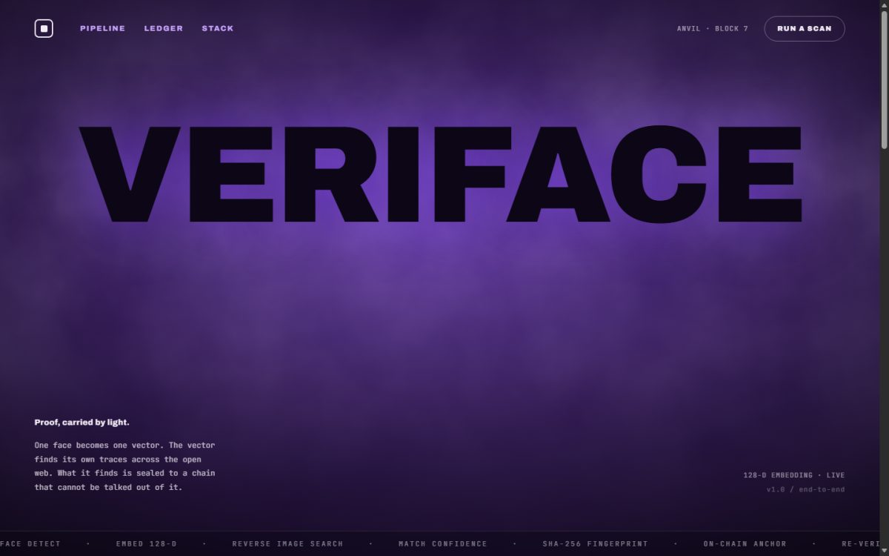
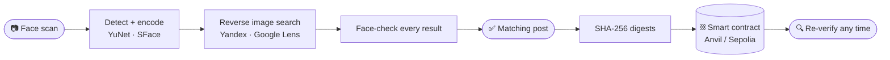
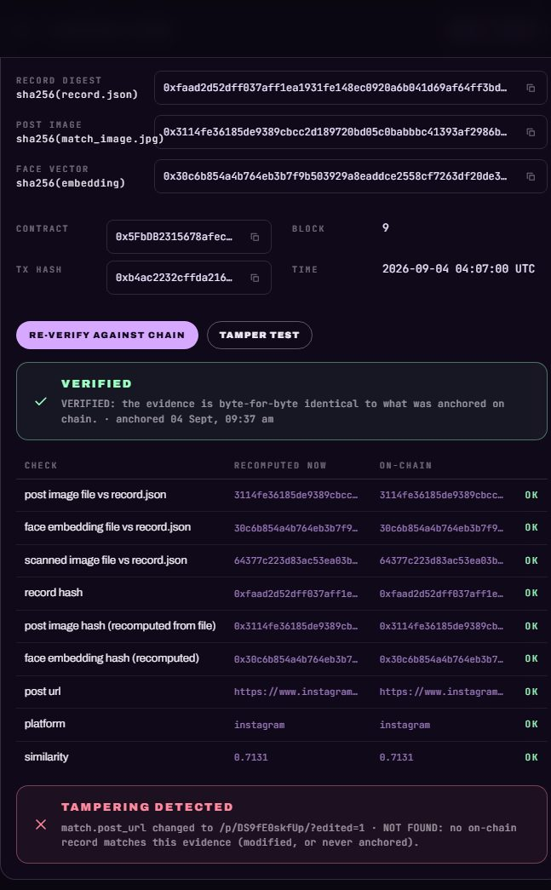

<div align="center">



# Veriface

**Scan a face → find the real social media post it appears in → seal the proof on a blockchain.**

[](#)
[](#)
[](#)
[](#)
[](LICENSE)

*HH Goa 2026 · Shortlisting Task 3*

</div>

<br>

## What it does



1. **Face scan** — you upload a photo or use the webcam. The face is detected and turned into a vector.
2. **Search** — the face is looked up on the web. Every result is checked against your scan, so only pages with the *same face* count. The best social media post wins.
3. **Blockchain** — fingerprints of the post and the scan are written to a smart contract. Later, one click re-verifies the saved evidence against the chain. A tamper test shows what happens when one byte changes.

Nothing is pre-picked: the results, the name and the post come from live searches every time.

<br>

## Run it

```bash
git clone https://github.com/sachin-2004jlr/HHGOA3.git
cd HHGOA3
python -m venv .venv && .venv\Scripts\activate       # Linux/macOS: source .venv/bin/activate
pip install -r requirements.txt
npm run setup
npm run dev
```

`npm run dev` starts the local blockchain node, the API and the web app together and opens the browser.
Press **Run a scan** in the header, drop a photo (or use the webcam), and press **Run a scan** again.

No API keys are required. Optional extras go in `.env` (copy `.env.example`):

| Setting | What it adds |
|---|---|
| `SERPER_API_KEY` or `SERPAPI_KEY` | Google Lens next to Yandex |
| `RPC_URL` + `PRIVATE_KEY` | A public chain such as Ethereum Sepolia instead of local Anvil |

<br>

<div align="center">

</div>

<br>

## What you see

| Card | Contents |
|---|---|
| **Pipeline** | The three stages running live, with timings and a log |
| **01 · Face scan** | The detected face and the hash of its vector |
| **02 · Matching social media post** | Your scan beside the found post, the similarity score, who the face was identified as, the other matched images |
| **03 · Blockchain record** | The digests, contract, transaction and block. **Re-verify against chain** recomputes everything from the saved files and compares it with the chain. **Tamper test** proves a changed byte is caught. |
| **Runs** | Every past run, reloadable at any time |

<div align="center">

</div>

<br>

## The blockchain

The same Solidity contract runs everywhere; only the endpoint changes.

| Backend | How | When |
|---|---|---|
| **Anvil** (default) | A real local Ethereum node started by `npm run dev`; state kept in `.anvil/` | Offline demo, nothing to fund |
| **Ethereum Sepolia** | Set `RPC_URL` and a funded `PRIVATE_KEY`, run `python -m facechain deploy` once | Public records with Etherscan links |
| **Simulated chain** | Proof-of-work blocks in `simchain.json` | No node at all |

```solidity
struct Record { bytes32 recordHash; bytes32 imageHash; bytes32 faceHash;
                string postUrl; string platform; uint16 similarityBps;
                uint64 timestamp; address submitter; }
function anchor(bytes32, bytes32, bytes32, string, string, uint16) external;
function getRecord(bytes32 recordHash) external view returns (Record memory);
```

<br>

## From the terminal

```bash
python -m facechain run --image photo.jpg                  # or --webcam
python -m facechain verify --evidence evidence/<run_id>
python -m facechain tamper-demo --evidence evidence/<run_id>
```

<br>

## Project layout

```
web/            React front end (landing page + console)
server/app.py   FastAPI back end
facechain/      pipeline · face · search · evidence · verify · chain/
contracts/      FaceMatchRegistry.sol and its compiled artifact
scripts/        one-command launcher, Anvil download, wallet helper
evidence/       one folder per run (not committed)
```

<br>

## Good to know

- Only people who exist on the public web can be found; a private face returns "no match".
- Yandex is read from its public results page and may rate-limit briefly. Google Lens does not identify people by design, so it only helps when the exact photo is already online.
- The chain stores hashes, not content: it proves the saved evidence is unchanged, not that the post still exists.
- Face search can be misused. Do not run it on people who have not consented.

<br>

<div align="center">
<sub>OpenCV · Yandex · Google Lens · FastAPI · React · Solidity · web3.py · Anvil</sub>
</div>
